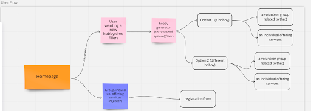

# GetOut

<h2>Overview</h2>
GetOut is a MERN (MongoDB, Express, React and Node) stack application inspired by the website Timeout London. It aims to support young people living in London after lockdown to find a new hobby or rekindle an old one. They can then join a group, participate in their new hobby and meet local people. 

.gif)

The user has the ability to find new hobbies, find new groups, lead and add a new group, register for a group and based on a few questions around their interests, have a new hobby generated for them. This project lasted 8 days and was completed with GA classmates Joan and Mike. 

See website [here](https://getout-london.herokuapp.com/) and GitHub repo [here](https://github.com/CNMABC/SEI-Project-3) 
 
<h2>Brief </h2>
<ul> 
<li>Create a full stack application creating both the back-end and front-end - using MongoDB, Node and Express to build the server-side API. </li>
<li>The API muse have 2 related models one of which should be a user.</li>
<li>The API must induce all RESTful actions for at least one model with CRUD principles mapped to REST commands. </li>
<li>Include authentication to restrict access to certain users. </li>
<li>Use React to build front-end that consumes the API.</li>
<li>Use React webpack and yarn to manage dependencies and compile source code.</li>
<li>Ensure planning phase include project plan and wireframes.</li>
<li>Be deployed online. </li>
</ul>


<h2>Technologies Used</h2> 
<ul>
<li>Node.js</li>
<li>Express</li>
<li>MongoDB</li>
<li>Mongoose</li>
<li>JavaScript (ES6)</li>
<li>React.js</li>
<li>JWT</li>
<li>Bcrypt</li>
<li>Axios</li>
<li>Git + GitHub</li>
<li>React Bootstrap </li>
<li>Figma</li>
<li>Asana</li>
<li>Miro</li>
</ul>


<h2>Approach & Planning</h2> 

Due to the time limitations I decided to split our team project into a series of 3 sprints containing either 2 or 3 days and create columns for bugs and extra features. eg. 1st sprint (Thurday-Friday), 2nd sprint (Saturday-Wedensday), 3rd sprint(Thursday-Friday 1.0ppm) Bugs, Extra Features.


With each ticket created in Asana I ensured it was labelled with the owners name and the stage it was at. We had daily stand-ups and at the end of each sprint review we moved each ticket to the completed area.


We began the design process with a word banking exercise which allowed us to build upon each others previous ideas, the result fulfilled the user need statement that :

“As a young person who moved to London in the last 3 years, I have found it difficult to meet new people or do something productive. I need somewhere I can find something fun to do which allows me to meet other young people in my local area that's safe and inexpensive. “

I then directed the team to create a user flow and site map below. 




We then decided on our related models and mapped these out:  


After understanding the user flow, their needs and incentives we used Figma and did some competitive analysis of sites that offered this already and researched designs we wanted to emulate. 


I then ran a group sketching exercise where we all created low fidelity wireframes. Using the heatmap process we decided which bits of each design we liked and I then created an MVP design using Figma. 


We started as group pair-coding the back-end and I created 2 schemas in our models for both the activity and group :

``` javascript 

const groupSchema = new mongoose.Schema({
 name: { type: String, required: true, unique: true },
 image: { type: String, required: true },
 activity: [ { type:String } ],
 location: {  type: String, required: true, maxLength: 600 },
 longitude: { type: Number },
 latitude: { type: Number },
 number: { type: String, required: true },
 about: { type: String, required: true },
 time: { type: String },
 level: { type: String },
 contact: { type: String },
 owner: { type: mongoose.Schema.ObjectId, ref: 'User', required: true },
 comments: [commentSchema],
 members: [memberSchema]
 // groupJoin: { type: mongoose.Schema.ObjectId, ref: 'User', required: true}
})

```
I also wrote the RESTful requests for the groups including index, create, show, delete and update. We split out the front-end and I created all the routes as well as the home-page and generator. 


<h2>Wins</h2>
<ul>
<li>The planning went really smoothly and the detail within the wireframes was incredibly helpful as it meant all team members could constantly refer to what we were trying to achieve and it meant people did not go off and waste time creating something that was not needed. </li>
<li>The design was slick and I was very happy with how it came together with the inclusion of modals and carousels. I enjoyed creating the Logo and researching the typography. </li>
<li>Through using React Bootstrap again I really pushed myself towards understanding the library in a lot more depth. </li>
</ul>


<h2>Challenges</h2>
<ul>
<li>On the homepage I designed the hero area to have a looped video playing as a background. </li><li>To apply the video behind the hero text was a lot trickier than expected and took much longer than I had planned for. Once completed it made a big impact on the first impression on the site but next time I would have researched applying a feature like this before including it into my designs. </li>
<li>The generator took a lot of time to figure out as it had multiple options to include and needed to filter into the database so I had to ensure all data had been cleaned before the process. I chatted the problem through with both my colleagues and teacher to resolve the problem. Included in the text was also the bootstrap styling.</li>
</ul>

``` javascript
     <div className="generator-area" style={{ minHeight: '25vh' }}>
       {indoorSelection && filteredActivities.length ? <h2 className="adventure">Select your adventure!</h2> : <h2 className="select-adv"> I want a new adventure that is ...</h2>}
       {!physicalSelection && <div className="Physical" style={{ display: 'flex', justifyContent: 'space-evenly', alignItems: 'center', height: '200px' }}>
         <Button style={{ width: '25%', height: '40%', fontSize: 'smaller' }} variant="outline-success" value="Physical" onClick={(event) => setPhysicalSelection(event.target.value)} size="lg">Physical</Button>{' '}
         <Button style={{ width: '25%', height: '40%', fontSize: 'smaller' }} variant="outline-success" value="Non-Physical" onClick={(event) => setPhysicalSelection(event.target.value)} size="lg">Non-physical</Button>{' '}
       </div>}
       {(physicalSelection && !competitiveSelection) && <div className="Competitive" style={{ display: 'flex', justifyContent: 'space-evenly', alignItems: 'center', height: '400px' }}>
         <Button style={{ width: '25%', height: '40%', fontSize: 'smaller' }} variant="outline-danger" value="Competitive" onClick={(event) => setCompetitiveSelection(event.target.value)} size="lg">Competitive</Button>{' '}
         <Button style={{ width: '25%', height: '40%', fontSize: 'smaller' }} variant="outline-danger" value="Non-Competitive" onClick={(event) => setCompetitiveSelection(event.target.value)} size="lg">Non-Competitive</Button>{' '}
       </div>}
       {(competitiveSelection && !creativeSelection) && <div className="Creative" style={{ display: 'flex', justifyContent: 'space-evenly', alignItems: 'center', height: '400px' }}>
         <Button style={{ width: '25%', height: '40%', fontSize: 'smaller' }} variant="outline-dark" value="Yes" onClick={(event) => setCreativeSelection(event.target.value)} size="lg">Creative</Button>{' '}
         <Button style={{ width: '25%', height: '40%', fontSize: 'smaller' }} variant="outline-dark" value="No" onClick={(event) => setCreativeSelection(event.target.value)} size="lg">Non-Creative</Button>{' '}
         <Button style={{ width: '25%', height: '40%', fontSize: 'smaller' }} variant="outline-dark" value="Sometimes" onClick={(event) => setCreativeSelection(event.target.value)} size="lg">Sometimes</Button>{' '}
       </div>}
       {(creativeSelection && !indoorSelection) && <div className="Indoor" style={{ display: 'flex', justifyContent: 'space-evenly', alignItems: 'center', height: '400px' }}>
         <Button style={{ width: '25%', height: '40%', fontSize: 'smaller' }} variant="outline-warning" value="Indoor" onClick={(event) => setIndoorSelection(event.target.value)} size="lg">Indoor</Button>{' '}
         <Button style={{ width: '25%', height: '40%', fontSize: 'smaller' }} variant="outline-warning" value="Outdoor" onClick={(event) => setIndoorSelection(event.target.value)} size="lg">Outdoor</Button>{' '}
         <Button style={{ width: '25%', height: '40%', fontSize: 'smaller' }} variant="outline-warning" value="Both" onClick={(event) => setIndoorSelection(event.target.value)} size="lg">Both</Button>{' '}
       </div>}

```

<h2>Bugs </h2>
<ul>
<li>Loading time of the photos is occasionally slow despite compressing all images to prevent this from happening. </li>
<li>After going to the login page, you are unable to go to the register page from that url, you need to go back to the home before you can then be directed to that part of the site. </li>
</ul>
 
<h2>Future Improvements</h2>
<ul>
<li>To enable people to comment on each group and share their experience.</li>
<li>To create a V2 of the groups page to enable more detail and improve the design.</li>
<li>To include a map displaying all groups across London and the option to filter by postcode. </li>
</ul>

<h2>Key Learnings</h2>
Make sure you research components before you include them in your final designs. I’ve realised how important it is to pseudo code elements before inclusion, as it gives you a greater understanding of the task and how long it might take. The importance of having high fidelity wireframes which all team mates have access to as visual communication is key with a virtual team. 
